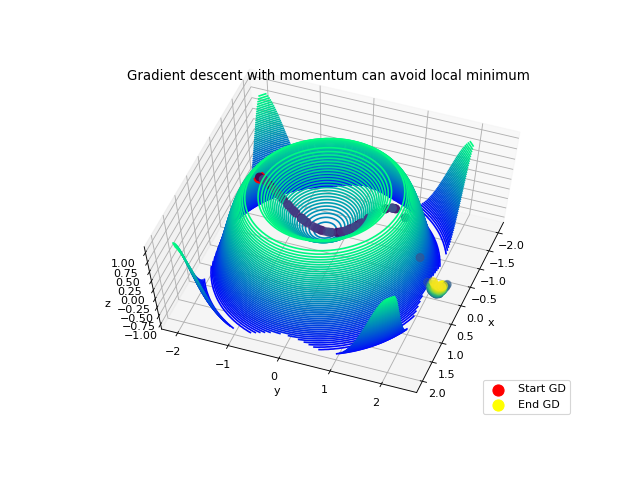

# gradient_descent

Project: https://apiquet.com/2020/03/28/neural-net-from-scratch-part-1/

This repository is to get familiar with gradient descent for known and unknown functions in 2D and 3D.

Here are some examples:

* Differential approach

* Perturbation approach

